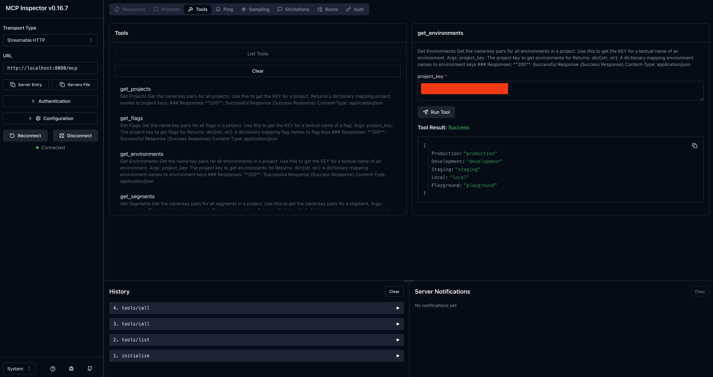
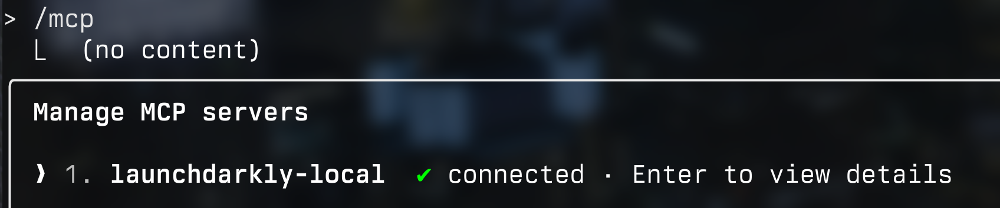
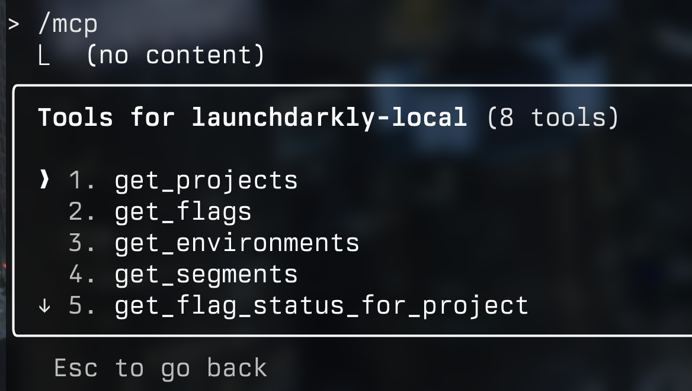

# Writing an MCP server around your vendor of chioce

This is a case study of something I did at work last week. It's a trendy thing to do and there were a few things I had to figure out, so here's a guide.

## Motivation

My company uses LaunchDarkly feature flags in our product. The ask is this: we often want to find out if a particular flag is enabled for a particular group of users.
 In case you're not familiar with LaunchDarkly or feature flags, here's all you really need to know:

- Segments are groups of users - in my B2B SaaS use case, customer firms.
- Flags: are Enabled or Disabled. If a Flag is Enabled, Flags are On or Off for a Segment, controlled through a Policy.

Note that it doesn't matter here what a flag actually does; I only want to know which ones are On and Off for which Segments. Specifically, three operations:

- Is Flag X On for Segment Y
- For Segment X: list all flags as On or Off
- For Flag X: list all segments for which X is On or Off

Now let's break out the steps for writing an MCP server:

- Write functions to answer the questions using the LaunchDarkly API
- Turn this into an HTTP MCP server
- Connect this to all various LLM tools

## Writing the Functions

Launchdarkly has a great API with tons of endpoints. We can knock out all these use cases hitting only a few of these endpoints. Immediately, we hit our first inferred requirement: our CSMs (the ones who are requesting this feature) won't always know the exact name of who they're asking for. For example, the customer firm might be called "Abbott & Costello Partners", but show up as "ACO Users" in the LaunchDarkly UI, and have the key of `all_aco_users` when using the LD API. Fortunately, this is the sort of thing we can mostly offload to the LLMs. The first functions to write are:

```python
get_projects()
get_flags(project)
get_environments(project)
get_segments(project, environment)
```

Each of which return a dict of textual name : key pairs. These are called first to translate user requests into queries on keys into the later methods. Those later methods are:

```python
# shows which flags are New, Active, Launched, Inactive 
get_flag_status_for_project(project)

# returns true/false for one flag and one segment
is_flag_enabled_for_segment(project, environment, segment)

# shows the policy JSON blob for which firms have a flag enabled/disabled
get_flag_policy(project, environment, flag)

# for each in (get all flags) checks is_flag_enabled_for_segment, returns list of Ons and Offs
get_all_flags_for_segment(project, environment, segment)
```

I'm going to assume you know how to write these functions, including API auth, validation, error handling, and some parallelism for that last one.

## Turning this into an MCP server

Since I wrote this in Python, I'm using [FastAPI](https://fastapi.tiangolo.com/tutorial/first-steps/) to turn these function definitions into API endpoints. From there, it's only a couple decrators to turn these API endpoints into MCP tools. For this I used [FastAPI_MCP](https://github.com/tadata-org/fastapi_mcp) Not to be confused with [FastMCP](https://gofastmcp.com/getting-started/welcome), which would also work, but I found it conflicted with some fastAPI specific middleware my company uses in our python service abstractions. (This sentence hides 10 hours of debugging. Please read it twice)

Turning an API into an MCP also lets you attach some tool descriptions and additional type decorators, which helps your LLM know how to interact with the tools. If your code is written clearly enough, I just told claude code to add these, and it's good enough for this app.

For testing this, there's 2 tools I use: the first is [MCP inspector](https://modelcontextprotocol.io/legacy/tools/inspector). It launches a nice web UI that lets you call tools manually, like swagger docs.



Once I've done my "unit tests" there, I use the MCP in claude code pointed at localhost to make sure the tools can call eachother correctly. I just drop this at the top level of my `.claude.json`:

```json
  "mcpServers": {
    "launchdarkly-local": {
      "type": "http",
      "url": "http://localhost:8080/mcp"
    },
    "env": {
      "API_KEY": "your_launchdarkly_api_key"
    }
  }
```

Launch Claude code, run /mcp to make sure that connection works, and that you can see all your tools. I invoke the MCP by asking a question, sometimes adding "Use the LaunchDarkly MCP" to be sure it goes right for that.

<!--  -->
<!--  -->

## Deploy this

Once again, this is a big "draw the rest of the owl" moment, but there's a lot of options here. If this is just for you, you can run this in a docker container on your machine. You could put it in a cloud of your choice. I deployed mine to my company's K8s cluster using our internal service abstractions. There's approximately 10,000 guides on how to deploy a webserver to the internet, so I won't write that guide here.

One specific failure case to keep in mind here - you might think that an MCP server is stateless, because no state is maintained between tool calls. You are Mostly Correct - a very dangerous kind of correct to be. The MCP server *does* maintain state, for *streaming outputs*. The built in service abstractions I used to deploy my app spawns 3 replicas by default, and when using the MCP in production, I got bad session errors, which was confusing, since I hadn't written any session logic. Rather than deal with that, I fixed this problem by just setting the app to run at 1 replica, which will be fine.

## Hooking it up

MCP servers can be local executables or accessed over HTTP. I went with HTTP here because this is being hooked into cloud vendors like [dust](dust.tt) and [devin](devin.ai) that do not support installing executables in the working environment. (Actually, devin does, but most don't).

To distribute installation steps for CLIs like Claude, I maintain a `configs` repo for my engineering team with a taskfile that installs all the latest and greatest tools. I tell everyone to pull the latest and `task update`, and everyone's ready to go.

I won't bother posting screenshots that are 90% redacted, but suffice it to say that now, asking claude "what flags are enabled for abbott & costello", or, "who's got (experimental feature #6) turned on" does in fact trigger the correct chain of MCP tool calls to get me my answer. Not only did I not have to navigate through the LaunchDarkly web UI or API, I was able to ask for it without even knowing exact slugs for the flags or firms. Nice!

## What did we learn

- MCPs are just annotated & decorated APIs
- LLMs handle some type corrections for you
- How to test your MCPs so you don't deploy something broken like a sucker
- Make your MCPs accessible over HTTP so you can access them in abstract API calls

I did this in 2 workdays. Is any of this rocket science? No. Will it save our CSM team a couple minutes at a time, times a thousand? Yes! Thanks for reading. Please go back to work.
